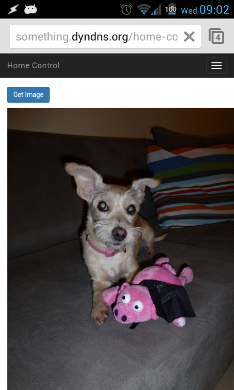

Webcam App
==========

Django app that implements the Webcam front-end of the home-control system.

App Description
---------------

This app implements the webcam web interface part of the project,
using a [Webcam RPC app](https://github.com/itamaro/home-control-RPC/tree/master/HomeControlRPC/cam). 

App Configuration
-----------------

The app uses the Django DB to store configuration,
so the configuration is managed via Django admin interface.

The app allows controlling unlimited amount of webcams,
each controlled webcam based on its own record in the DB.

The settings:

* `name`: A name for this controlled webcam.
* `rpc_url`: The webcam RPC URL to be used for taking snapshots.
* `snapshot_path`: Path relative to `MEDIA_ROOT` to store the webcam snapshots.
  Specify path including filename, and omit the file extension - it is deduced from the RPC response.
  The web server requires write access to the directory, that must exist in advance.
